# シキセン 1.0

注意：諸事情によりアプリの公証は現在行っておりません。使用したくても不安な方はソースコードを確認した上でXcodeでビルドするか、アプリの公証が行われるまでお待ちください。

注意：この文書は開発も行う人向けのものであり、一般用のソフトウェアのウェブサイトと説明は別途作成予定です。 
 

## 動作環境
macOS 15.0 以降（macOS 26.0 以降は未検証）、M1チップ以降推奨 
Mac内蔵のトラックパッドまたは Magic Trackpad 必須 
滑らかな線を引く場合、ペンタブレット必須

動作確認済みペンタブレット： Wacom Intuos Pro (2013, 2025), XPPen Deco Pro (Gen2) 
 

## 概要

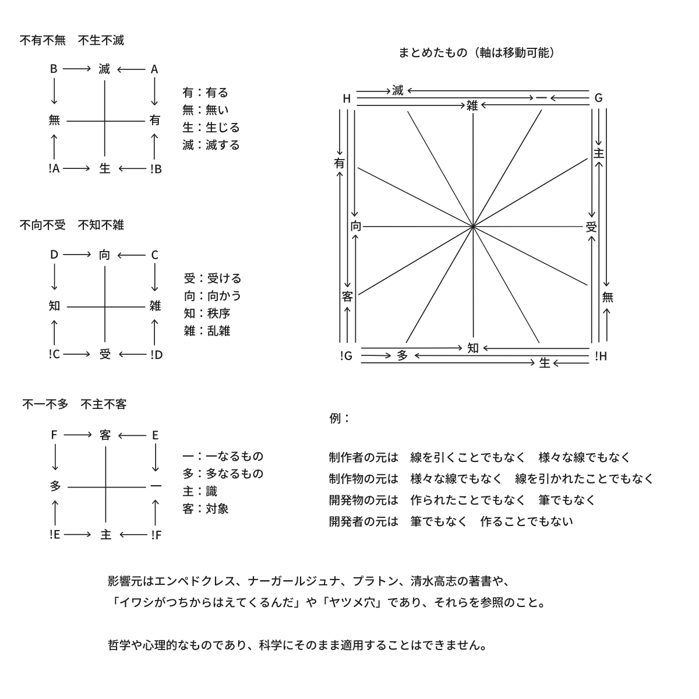
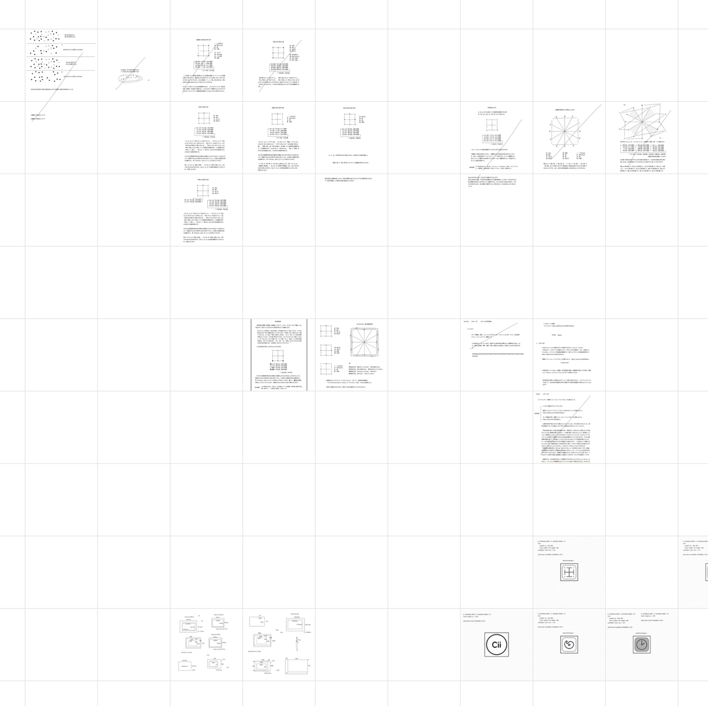
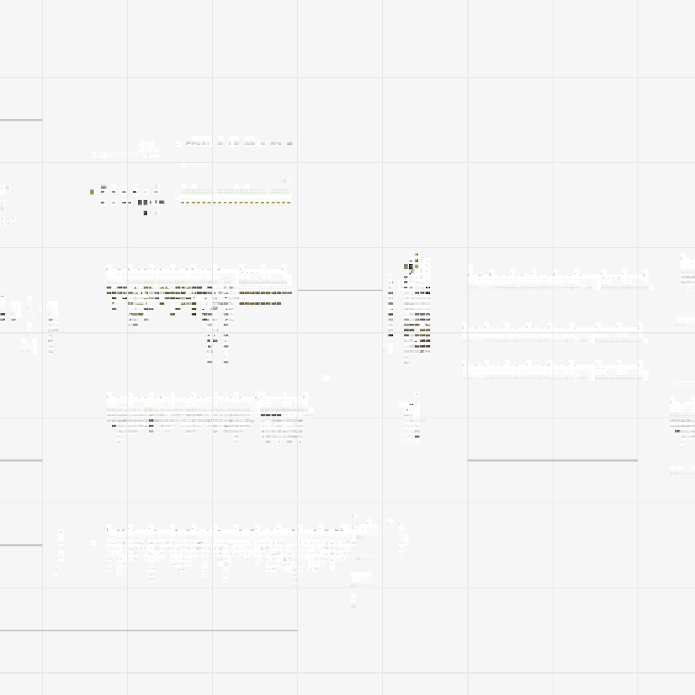

　メモやスクラップブック、絵、漫画、アニメーション、音楽、効果音、声などの制作ができる制作統合環境です。 
 
　統合的で汎用的であるためには特定の何かのための操作を切り捨てることになります。つまり、この環境で作品を作ったりするためには色々な特定の表現を諦める必要があります。テキストエディタで考えるなら文字装飾の類は使用できず、文字だけで勝負するというような形になります。絵で言えば主に鉛筆だけ、音楽で言えば主に一つの楽器だけを使って何かを作り続けるようなソフトウェアです。ただ、領域色や音色の持つ伝達情報量が多いのでそれだけを、操作の妨げとなるようなモードが生じにくいよう慎重に取り入れました。 
 

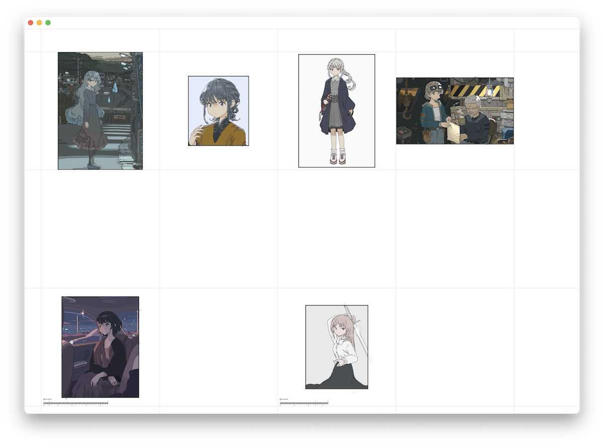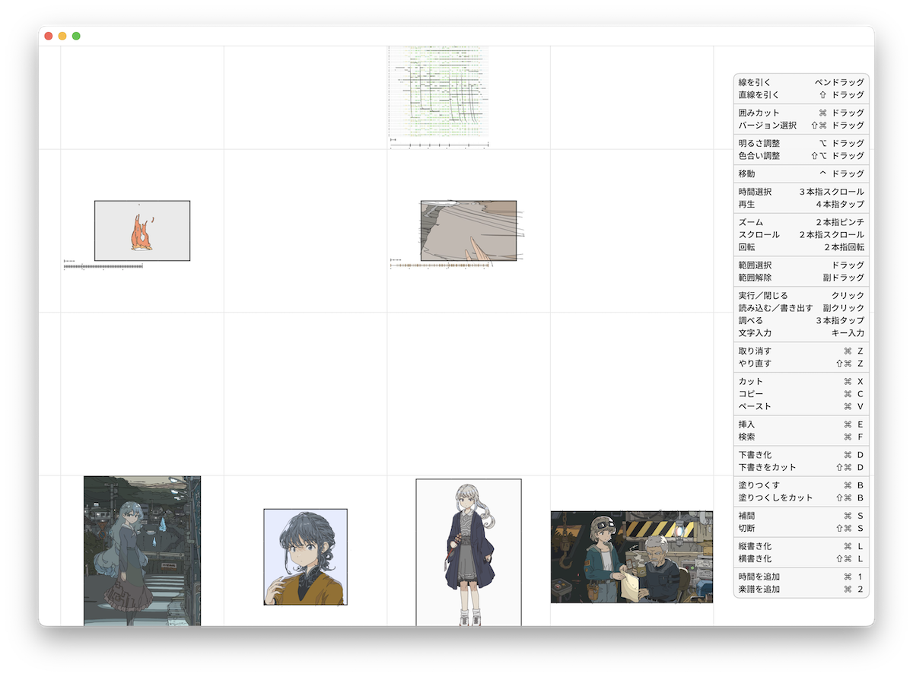 
　このソフトウェアの最大の特徴の一つとして、一般的なグラフィックソフトウェアにあるようなツールパレットがありません。少数の汎用性のあるアクションを徹底的に絞り、ストロークのサイズや形も絞り、Shiftを押しながらドラッグなどのような一時的なモードを使う前提とすることで、より身体性に近い操作体系となるようにしています。取り消しやコピー、ペーストなどといった通常のアクションもすべて一時的なモードとして設計してあり、ボタンを押し込んでいる間だけ対象が強調表示されたり、ペーストボタンを押しながら貼る場所を調整できたりなど、結果が神経に紐づくように返ってきます。そしてそれぞれのアクションに高い汎用性があることで、テキストとアニメーションと音楽が同一の操作方法でありながら作りやすいようになっています。 
 

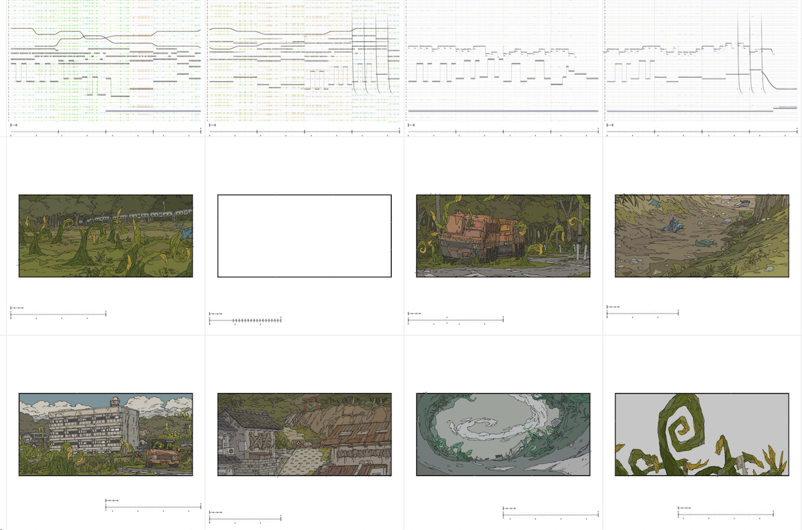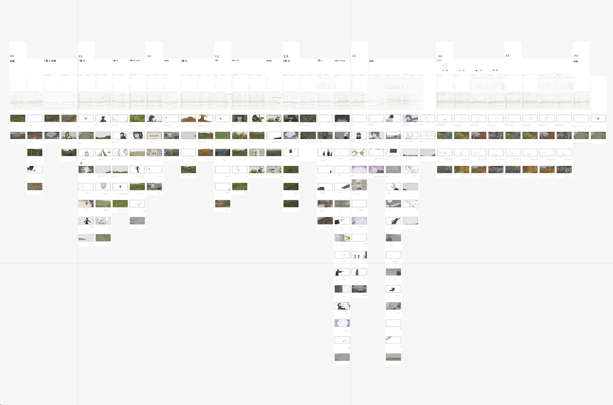 
　このソフトウェアの開発は、情報を最も普遍的に操作できることを目指して操作を厳選して設計したところから始まり、それらを転用してアニメーション、そして音楽を作れるようにしていったものです。短編アニメーション作品「[ヒトコゴミ](https://youtu.be/iI6KXlpBCuc)」はその普遍的な操作の余剰の中で生まれてきたものです。「ヒトコゴミ」は完全にこのソフトウェアだけで作られており、イメージボードや、絵コンテからレイアウトや作画や仕上げや、歌詞の考案や音楽や効果音や声の制作まで境界を超えてシームレスであり、いろいろな作業に行ったり戻ったりをしながら制作しました。 
 

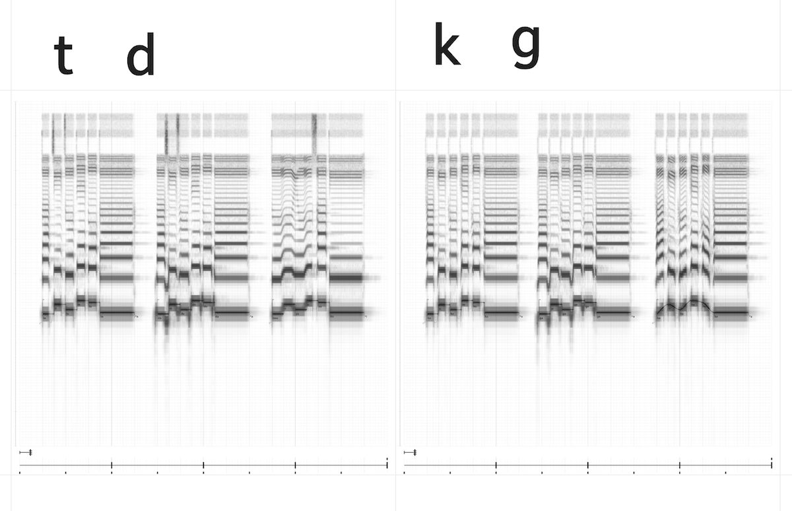 
　また、今回の声や効果音の研究、ソフトウェアの設計の一部もこのソフトウェアで行いました。

 
　このソフトウェアは統合的なことができますが、前述の通り、その他の細かい操作は諦めているということでもあります。実際「ヒトコゴミ」より細かく画風的な意味で複雑なものは作れません。ツールパレット自体は間違えても取り消しをするだけで済むので、モードによる問題はあまりありませんが、とにかく線や文字などの最小に近い情報だけを追求していきたいときには若干不便なところがありました。 
 
　例えば「英数」と「かな」（あるいは「ABC」と「あいう」）入力においては、まずそれらが打ちやすいところにあり、「英数」ボタンを押して（短期記憶にある間）文字を打つ、「かな」ボタンを押して（短期記憶にある間）文字を打つ、という行為がそれぞれ一つのジェスチャーとして習慣化されているためにあまり問題なく機能します。それでも長期間同じモードで打ち続けていたりすると間違えることがあります。取り消しで元に戻せても、集中力やイメージに少なからず影響してしまうことがあったので、ストロークでその妥協はしたくありませんでした。覚えることが増えるという弱点はありますが、頻度が非常に高いストロークやキー入力だけでもなるべくその場で、そのままの状態で入力できるようにしておきたかったため、今回の設計思想としました。 
 

　ジェフ・ラスキンは著書『ヒューメイン・インターフェース』(1) の中でモードについて次のように述べています。

>あるジェスチャに対してマン・マシン・インタフェースがモードを持つのは, (1) インターフェースの現在の状態がユーザの注意の所在となっておらず, (2) そのジェスチャに対して複数の異なった応答がインタフェースによって実行される場合

　コンピュータ上での注意の所在がユーザーの注意の所在と一致しており、その注意の所在に対して何かのジェスチャーが常に同じ結果を持てばモードの問題を回避できるということになります。逆に考えれば、何かのジェスチャーに対して、注意の所在ごとに特定の操作を持たせることが可能です。このソフトウェアでは行動によるモードをアクションとし、アクション名の範疇で、対するオブジェクトの種類や形によってアクションの結果が変化します。例えば楽譜上に線を引けば音符線になり、線の端で移動すれば逆の端を基準としたワープ変形になったりしますが、それらは常に統一的なルールで、ある行動に対して１通りだけの即時的なフィードバックがあるため学習しやすく、モードの問題を受けにくいようになっています。上野学は著書『モードレス・デザイン』(2) の中で次のように述べています。

>モードがない状態はモードレスと表現されるが、それは解釈の仕方が存在しないという意味ではなく、解釈が一定していて変わらないということである。つまり、モーダルデザインとはモードが変化するデザインのことであり、モードレスデザインとはモードがひとつだけあって変化しないデザインのことなのである。ソフトウェアは使用者の操作に応じて何らかの反応を示す。その意味を解釈するのは使用者である。解釈がなければコンピューターはただの箱である。道具が意味を持つならば、そこには必ず解釈＝モードがあるということだ。 
>　では、インターフェースからモードを除去していった時に最後に残るモードとは何か。それはシステムの振る舞いを純粋な仕方で使用者が解釈している、そういう状態だろう。だから最後に残るひとつのモードは、使用者があらかじめ持っているモードなのである。

　銀色の物をハンマーで叩くと音を奏で、一方、透明な物を同じように叩くと粉々になった。 
　紙にペンを滑らせると餅が描け、一方、布の上で滑らせるとガタガタの石になった。 
 
　人は注意の所在に向けて何かのジェスチャーを行うとどうなるかを１セットで把握していき、そのジェスチャーを一つのアクションとしてそこに解釈を持っていきますが、同じ銀色の物でもハンマーを使って同じ力で叩くと不意に割れる物もあります。これはモーダルですが、銀色の物の中にはハンマーで割れるものと割れない物があることを知ること自体は悪いことではないと思います。通常はそこに法則を見つけたりしてさらに識別していくか、割合として低ければそれを許容して習慣化していきます。その主観と客観の折り合いである道具も時折調整していきます。または銀色の物を叩くことさえできればいいのであればそもそも問題でもありません（今度は銀色の物とそれ以外の対立が生じますが）。手に持っている物も実はピコピコハンマーで変な音を奏でるだけだったということもあり、これも同じことです。 
 
　問題はコンピュータの世界では抽象化されていて、それらの手触りなど細かいところをあまり把握していけないところにあります。そして「割れないはずの割れる物」に遭遇する割合が開発者の良かれと思った恣意性によって高くなってしまいがちです。それを今のコンピュータの中で解決するには制作者と開発者を行き来するか、「制作者の解釈（＝モード）による期待」と「注意の所在とジェスチャーの１セット」がなるべく等しくなるようにしなければいけません。また、注意の所在が排他的でなければ期待が衝突する事故が時折発生します。例えば、スクロールビューの中にスクロールビューがある場合などです。 
 

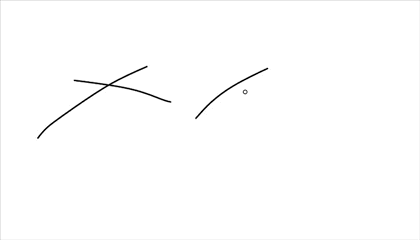 
　なるべく人の注意の所在と選択オブジェクトが一体となるように、カーソルで指し示した位置が既に選択であり、文字入力もカーソルの位置から即時に始まります。「範囲選択」によって一時的に追加した複数選択を指し示すことで複数選択操作となります。そのため、ユーザーは基本的にアクションを覚えなければこのソフトウェアはうまく使えません。まずは使えそうなアクションから試して遊んでみてください。ある程度はＯＳの操作性と互換性を持たせており、大抵の編集は標準的な「範囲選択・取り消し・やり直し・カット・コピー・ペースト」だけでこと足ります（なお、このために新しいイベント体系を設計しており、Modelを持つView（Object）に対してなんらかのジェスチャー（Verb）を行った解釈の一まとめをActionとしています。本ファイル群にActionやViewと名付けてあるものがそれであり、それとＯＳ互換のApp.swift以外はModelファイルです）。 
 

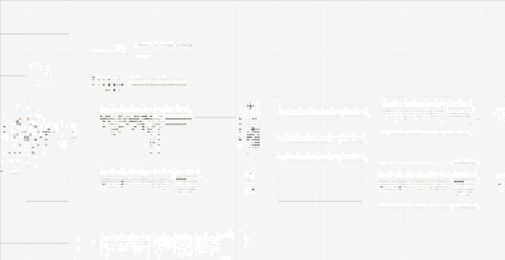 
　そして、全体と部分が常に同時的に編集可能であるように、ＺＵＩ（ズーミング・ユーザーインターフェース）を採用しています。そのためにＧＰＵを限りなく利用する描画体系とＧＵＩ体系を作りました。即時的で滑らかなズーミング操作を前提としているため、本ソフトウェアではトラックパッドが今のところ必須となっています。ただのズーム動作ではなく、慣性処理などを調整してスクロールと同等に楽に移動できるようにしてあります。誤って遠くに離れたり、離れ小島になったシートに行っても迷子にならないようにナビゲートラインが邪魔にならない程度に表示されます。 
 
　ファイルという概念はなく、ストレージからの読み込みや書き込みも気づかないうちに、あるいは大きなデータでも極力目立たないように読み込みや書き込みを行います。イメージとしてはファイルやフォルダの代わりに、いくつもの町を作るような感じです。平面にはシートが敷き詰められており、コンテンツの表示範囲や取り消し範囲はそのシート内になります。 
 

 
　このソフトウェアは常にオートセーブで、「範囲選択」の結果や「取り消し」も保存します。ほとんどのソフトウェアでは取り消しの後に何かを書き込んだことで消滅する「やり直し」もバージョンとして保存します。 
 

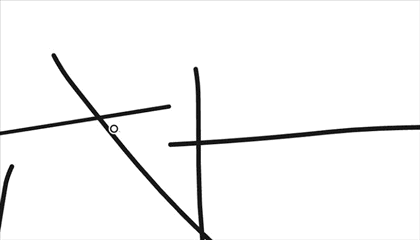 
　ほとんどすべてのアクションはオブジェクトに対して知覚的に作用します。例えば「囲みカット」では交差した線を曖昧な位置で囲っても、今の視点での知覚距離に基づいて綺麗に交差点で切り取るようになっています。アクションがオブジェクトに反応する最大距離は、ズーム倍率によって適した知覚距離になります。 
 
　上記でも書いたようにストロークは常に同じ太さで、いつでも必ず同じような線が引けるようになっています。より細い線はペンの筆圧や傾きによってある程度コントロールできますが、逆に言えば太い線はこのソフトウェアでは引けません。筆圧の入り、抜きは自動補正され、手ぶれ補正はメモ、下書き、清書など、どんな場合でも常に程々なバランスで動作するように調整しました。線はベクターとして操作でき、線単位で後から移動や変形などができます。 
 

 
　配色は一回で範囲内または選択内をすべて塗り分けるようになっており、色の編集は知覚的に均等になるようにしてあります。塗り分けは線の変更に合わせて差分更新が可能であり、これに時間軸が加わると、結果的にアニメーションの瞬時な自動着色になります（算術処理であり、ＡＩは含まれておりません。また、動きが小さい時のみ機能します）。楽譜上では音符の音色としてノイズやスペクトルのパネルを生成するようになっています。その音色を操作することで、効果音を作ったり、デフォルト以外の楽器の音色とすることができます。 
 

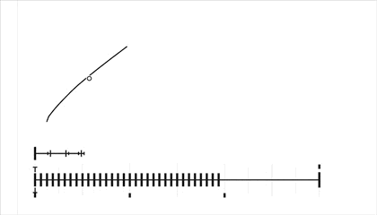 
　追加できるタイムラインは楽譜に限らず、秒ではなくビートが基準になっています。動画の標準フレームレートを満たすようにテンポを調整することも可能です。コピーした線のＩＤを使用して、前述のアクション設計によって別の時間軸の線と素早く補間することができ、それによって作画の全体や一部分を綺麗に滑らかに動かせたりできます。タイムラインを持つシートを縦横に並べていくことで絵コンテから仕上げまで同じ形式で作業を続けることができます。同じ時間のタイムラインを持つシートを上下に連ねると上下の線が薄く転写されるため、それをレイヤーとして使用できます。また、楽譜シートと作画シートを同時に再生することができます。 
 

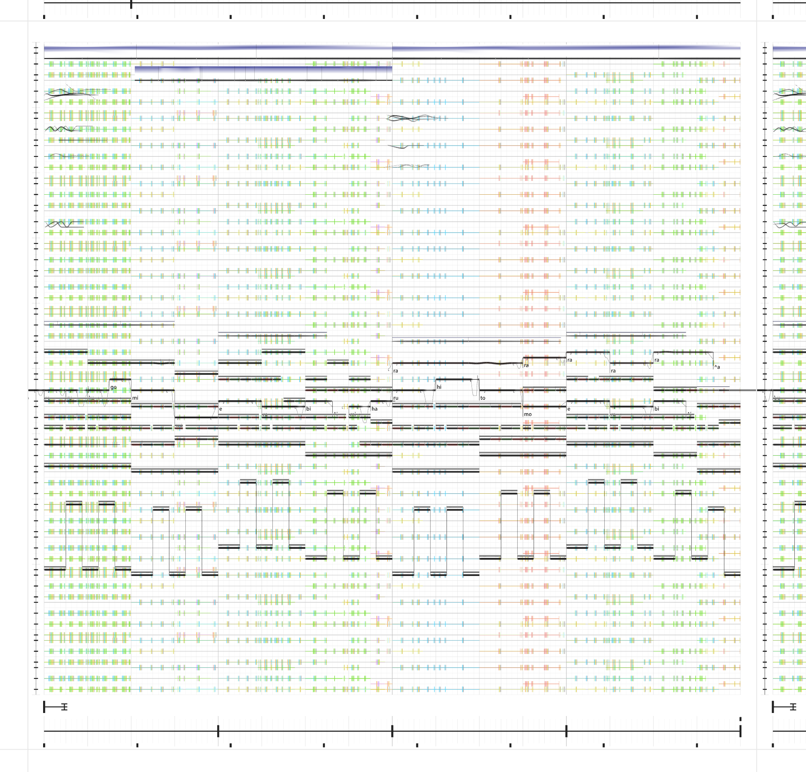 
　楽譜は常にリアルタイムで引かれた音符の和音を最小の和音の組み合わせで、音量も考慮して背景に表記します。どこにトライトーンがあったり、メジャーコードがあったりするかを視覚的にも把握できるようになっており、それらの組み合わせを覚えることで四和音以上も把握できるようになっています。楽譜上でキー入力をすることで声の入力になります。最大限ズームした状態で音符を移動することで他の音符に対して相対的な純正比率をスナップすることもでき、許容できる音程のズレを考えることで平均律と純正律を自由に行き来できます。 
 

　最後にこのソフトウェアについて、制作者が開発に手を出してしまい開発者となってしまった制作者が、制作と開発を右往左往した果てにできたものです。統合的としつつも、開発者にとって好きなことが中心になっており、また、設計に問題があると思うところがまだまだたくさんあります。もし、他の誰かにとって現時点のこのソフトウェアが最低限遊べるものであるなら幸いです。 
 

## 現在の問題点と今後の予定
　本ソフトウェアの改善要望やバグ修正要望は今のところ受け付けておりませんのでご了承ください。また、英語が分からないので、英語は自動翻訳でしか対応できません。バージョンは1.0となっていますが破壊的なアップデートが行われる可能性は十分あり、将来のバージョンでデータや操作の互換性が失われる可能性があります。特にアニメーションや音楽周りはまだ設計が未熟で安定していません。下記は主要な問題のリストです。

- macOS以外への移植は今のところ予定しておりません。移植を行うには「#if os(macOS)」以外において、同等のimportを用意する必要があります。

- OS標準のメニュー操作は設計が異なるためにほとんど使用できません。ソフトウェアに馴染みやすいようにOS基準の一般的な操作方法を選択できるように開発することは可能ですが、今のところ開発の予定はありません。

- ＭＩＤＩキーボードは今のところ未対応です。開発者自身が使い方をよく知らないためです。

- 音量の計算が不完全であり、また、サウンド全体がまだ最適化されておらず、かなりの処理時間とメモリを消費します。

- 読み込んだ動画コンテンツや画像コンテンツは開発中であり、全体タイムラインの再生やエンコードに反映されません。画像や動画の書き出しは楽譜やタイムラインの描画が未対応です。

- まだ表に出せるほどのものではない、開発中のプログラミング言語が隠し機能として存在しています。

- 一部アクションや、互換性のためのアクションの別ジェスチャーが隠し機能として存在しています。

- シートのリサイズや倍率変更や入れ子をできるようにして完全なＺＵＩにする予定です。

- 枠の導入は遅れたため、設計的に安定しておりません。現在、シートの枠をコピーして内枠などとしてペーストできるようになっていますが、可視性はありません。

- 検索後の置き換えは全体が対象で、一部を対象から外すことができません。

- 上下にシートを連ねると上下の線が薄く転写されるタイムラインレイヤーは、レイヤーの選択がズーミング視点と一体となっていてレイヤーの選択モードがないと言えますが、時間選択モードがある以上、そちら側に十字移動操作として統合して１シート内にまとめた方がいいのではという案があります。なお時間選択モードもズーミング視点に統合する案がありましたがこれは操作がしにくく廃案となりました。

- 特定のオブジェクトに対して「開発中」と表示される一部のアクションは、将来のバージョンで対応予定です。特にズームアウト時のシート全体表示に関するアクションがかなり未実装です。

- 個人的な作業の中でごく僅かな使用率の動作について、モーダルダイアログや進捗ダイアログが設計として残っています。例えば共有のためのファイルの読み込みや書き出し、シートまたは全体履歴の消去、たくさんのシートの履歴が一括変更されるようなアクションなどです。これらはいずれ設計を変更する予定です。

- ある程度はＯＳと互換性を持たせましたが、一部のトラックパッドの操作がＯＳの設定によっては重複しており、その場合、今のところＯＳ側の設定の変更が必要になる可能性があります。例えば、時間選択は普遍的でいつでも即時的に操作可能であった方がいいと考え、空いていたトラックパッド操作で簡単にその操作ができるように設計しましたが、実際にはユーザーによって操作が衝突します。いずれドラッグや指操作を含めたすべてのアクションのジェスチャーを別のジェスチャーに変更できるように修正する予定です。

- macOSのバグにより、OSのスリープ復帰後に一部の内蔵トラックパッドのイベント（func touchesBegan(with nsEvent: NSEvent) 関連）が届かなくなることがあるため、迂回方法として文書化されていない関数を使用しています。そのため、macOSの将来のバージョンでは動作しなくなる恐れがあります。また、迂回方法は完全ではなく、スリープ前に内蔵トラックパッドをソフトウェア内で一度も使用せずにスリープを行って問題が発生した場合はうまく動作しません。その場合、ソフトウェアを起動し直すことで治ります。修正方法として、バックグラウンドアプリに分離してスリープごとにそれを再起動する方法など模索中です。

- 上記の問題などにより、Mac App Store での公開を延期しております。野良アプリとしての単独での公証は未定です。 
 

## プライバシーポリシー
本ソフトウェアはデータを収集しません。詳しくは
[プライバシーポリシー](Shikisen/PrivacyPolicy.md)をご確認ください。 
 

## ライセンス
[GNU General Public License v3.0](License.md)

©︎2026 [Cii](https://x.com/cii0000) 
 

## 謝辞
[本ファイル群に関する謝辞](Shikisen/Acknowledgments.txt) 
 
参考文献： 
(1) ジェフ・ラスキン、村上雅章訳(2001) 『ヒューメイン・インタフェース: 人にやさしいシステムへの新たな指針』 ピアソン・エデュケーション. pp.47-48. 
(2) 上野 学(2025). 『モードレスデザイン　意味空間の創造』 ビー・エヌ・エヌ. Kindle版 p.351.
 
 
 
※ 本ソフトウェアに生成ＡＩ技術は含まれておりません。 
※ 本ファイル群に記載されている商品やサービスなどの名称は、すべて各団体や各社の商標または登録商標です。
